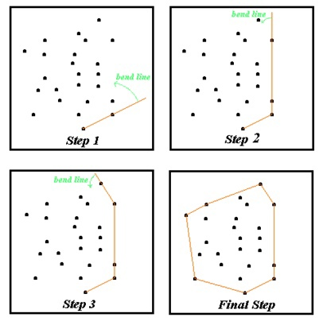
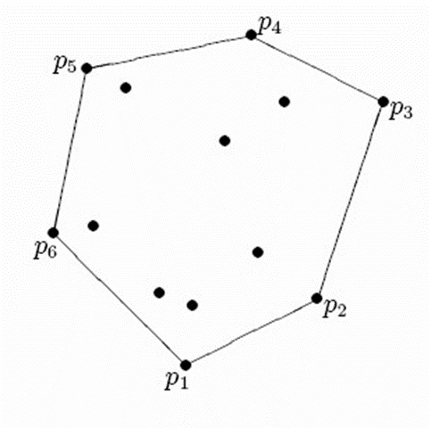

<h1 align=center>Задача построения выпуклой оболочки (2D)</h1>

## Используемые средства:
### 1. С++
### 2. Wolfram Mathematica
## Методы решения задачи
### 1. Метод перебора
*Суть этого метода заключается в поиске точек, образующих такие прямые, 
что все остальные точки лежат по одну сторону от этой прямой.*

<table>
<tr>
<td> </td>
 <td></td>
</tr>
</table>

### 2. Алгоритм Киркпатрика - Зейделя
*Алгоритм основан на известном методе "разделяй и властвуй", когда исходная задача разбивается на подзадачи, затем с помощью рекурсии решаются подзадачи, после чего каждый такой результат объединяется в общее решение – ответ на исходную задачу. Однако алгоритм Киркпатрика – Зайделя отличается тем, что эти действия происходят в обратном порядке: сначала необходимо определить, как решения подзадач будут объединяться, 
а лишь потом решить эти подзадачи.*

